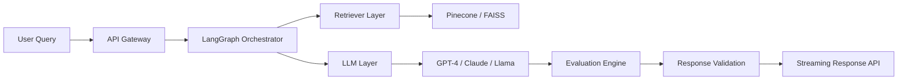

<div align="center">


<br/>


<br/>
<br/>

<p align="center">
  <a href="https://github.com/Ramesh0329">
    
  </a>

  <a href="mailto:ramesh.n13n@gmail.com">
    
  </a>

  <a href="https://linkedin.com/in/rkoduru90">
    
  </a>

  <a href="https://github.com/Ramesh0329">
    
  </a>
</p>

</div>

---

---


---

# ⚡ AI Systems Engineer | GenAI Architect | LLMOps Engineer

```yaml
Name: Ramesh Koduru
Experience: 11+ Years
Focus:
  - Production-Grade Generative AI
  - Retrieval-Augmented Generation (RAG)
  - Autonomous Multi-Agent Systems
  - Distributed AI Infrastructure
  - LLMOps & AI Observability
  - Cloud-Native AI Platforms
  - Semantic Retrieval Architectures
  - AI Inference Engineering

Currently Building:
  - Enterprise AI Orchestration Platforms
  - Multi-Agent AI Systems
  - AI Evaluation Frameworks
  - Distributed Inference APIs
  - Intelligent Document Processing Pipelines
```
# 🧠 AI Engineering Philosophy

```yaml
"Modern AI systems are not just models.
They are orchestration ecosystems involving retrieval,
evaluation, observability, scalability, and autonomous reasoning."
```
# 🚀 Core Engineering Domains

<table>
<tr>
<td width="50%">

## 🧠 Generative AI & NLP

- RAG Architectures
- LangChain / LangGraph
- OpenAI / Azure OpenAI
- AWS Bedrock
- Prompt Engineering
- Semantic Search
- Transformer NLP
- Conversational AI
- Intent Detection
- Semantic Routing
- AI Agents
- Hallucination Reduction

</td>
<td width="50%">

## ⚙️ AI Infrastructure & LLMOps

- Kubernetes
- Docker
- FastAPI
- MLflow
- CI/CD Automation
- GPU Inference
- AI Observability
- Distributed Systems
- Autoscaling APIs
- Drift Detection
- Prompt Evaluation
- AI Governance

</td>
</tr>
</table>

# 🌌 Production AI Architecture



---

# 🔥 Featured AI Systems

## 🧠 Enterprise RAG Platform
> Production-grade Retrieval-Augmented Generation ecosystem with semantic retrieval, reranking, evaluation pipelines, and intelligent grounding.

### Stack

```txt
LangChain • LangGraph • Pinecone • FAISS • FastAPI • Kubernetes
Azure OpenAI • AWS Bedrock • Reranking • Hybrid Search
```

---

## 🤖 Multi-Agent AI Orchestrator
> Autonomous AI orchestration framework supporting reasoning agents, memory coordination, workflow routing, and tool execution.

### Capabilities

- Planner / Executor Agents
- Tool Calling
- Autonomous Workflows
- Memory Coordination
- AI Routing Systems
- Agent Collaboration

---

## ⚡ AI Inference Gateway
> Low-latency distributed inference platform for scalable LLM and NLP deployments.

### Features

- Streaming Inference
- Async APIs
- Autoscaling
- GPU Deployment
- Observability
- Token Monitoring

---

## 📄 Intelligent Document Processing
> Enterprise document intelligence workflows integrating OCR, semantic extraction, validation pipelines, and NLP-driven automation.

### Features

- OCR Pipelines
- Entity Extraction
- Semantic Chunking
- Validation Rules
- Human Review Systems
- Knowledge Extraction

---

# 🛠️ Technology Ecosystem

<div align="center">

## Languages


---

## AI / ML / NLP


<br/>


---

## Cloud / DevOps / Infrastructure


---

## Big Data & Streaming


<br/>


---

## Vector Databases


</div>

---

# 📊 Engineering Metrics

<div align="center">


</div>

---

# 📈 AI Engineering Activity Graph

<div align="center">


</div>

---

# ⚙️ Current Engineering Focus

```python
class CurrentFocus:

    def __init__(self):
        self.domains = [
            "Enterprise RAG Systems",
            "AI Agents & Autonomous Workflows",
            "LLMOps & Evaluation Pipelines",
            "Distributed AI Infrastructure",
            "Inference Optimization",
            "AI Observability",
            "Semantic Retrieval Systems",
            "Scalable AI APIs"
        ]

    def build(self):
        return "Production-Grade AI Ecosystems"
```

---

# 🧪 AI System Capabilities

| Domain | Capabilities |
|---|---|
| Generative AI | RAG, Agents, Semantic Retrieval |
| NLP | Intent Detection, NER, Conversational AI |
| AI Infrastructure | Kubernetes, GPU Inference, Autoscaling |
| LLMOps | Evaluation, Monitoring, Drift Detection |
| Data Engineering | Spark, Kafka, Streaming Pipelines |
| Cloud AI | AWS Bedrock, Azure OpenAI, Vertex AI |
| MLOps | CI/CD, Model Governance, Observability |

---

# 🌍 Connect With Me

<div align="center">

<a href="mailto:ramesh.n13n@gmail.com">

</a>

<a href="https://linkedin.com/in/rkoduru90">

</a>

<a href="https://github.com/Ramesh0329">

</a>

</div>

---

<div align="center">

## ⚡ Engineering Intelligent Systems for the AI-Native Future


</div>
